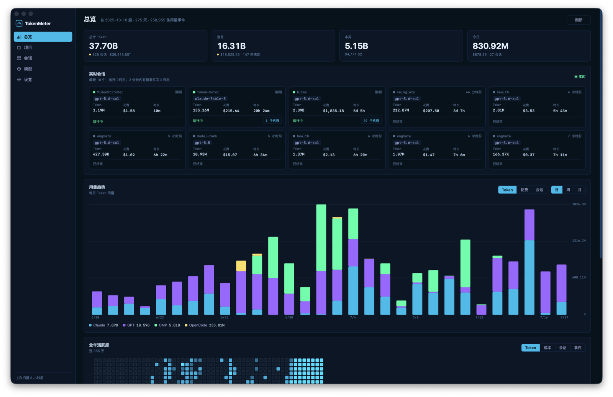
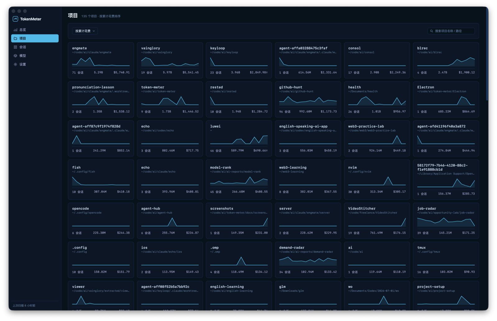
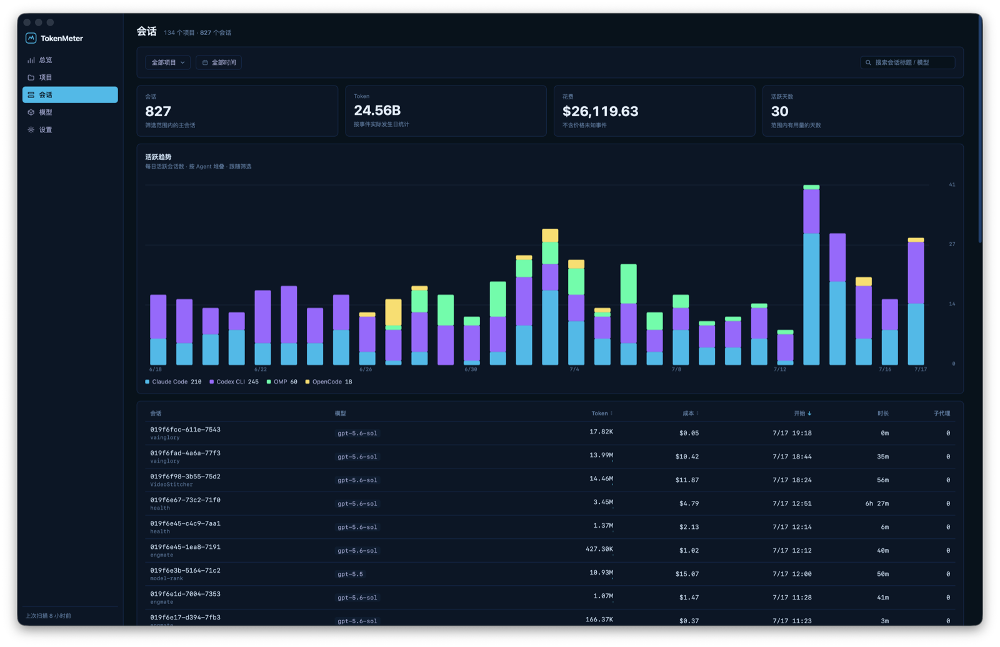
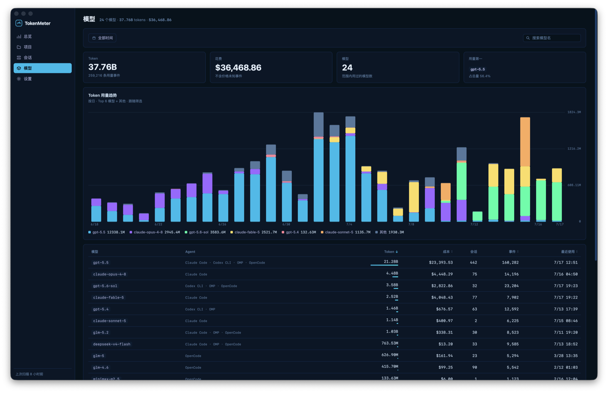
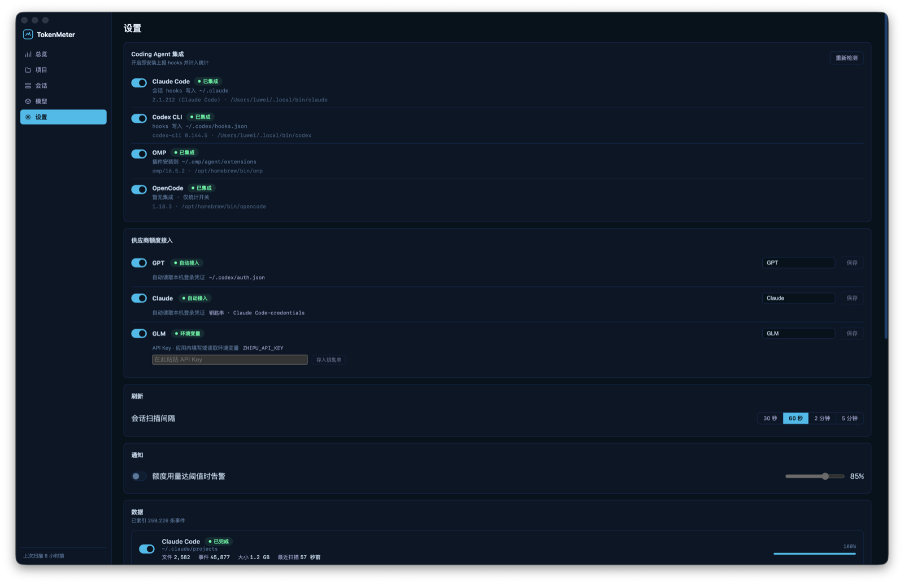
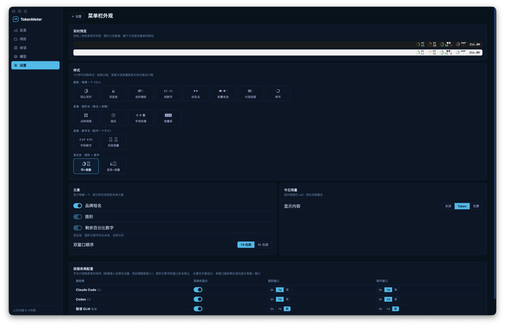

# TokenMeter

[English](README.en.md) | 简体中文

**macOS 菜单栏里的 coding agent 用量仪表盘** —— 实时统计 Claude Code、Codex CLI 等本地 AI 编程工具的 token 用量、花费与订阅额度，全程本地、零上传。


## 它解决什么问题

重度使用 coding agent 的人每天都在问三个问题：**今天烧了多少 token？这周额度还剩多少？钱都花在哪个模型上了？** TokenMeter 把答案常驻在菜单栏——额度环一眼看余量，点开是完整仪表盘。

## 功能

### 菜单栏常驻

- **多供应商订阅额度**：5 小时 / 7 天窗口剩余百分比，时间进度感知的警戒色（绿=充裕、黄=消耗偏快、红=用尽）
- **16 种可切换样式**：同心双环、竖条、胶囊电池、点阵、哨兵、双层堆叠……看腻了随时换
- **深度定制**：品牌名 / 图形 / 数字逐项开关，每家供应商独立配置显示窗口，今日用量尾巴三态（Token / 花费 / 关闭）
- **额度告警**：用量达到阈值时系统通知
- **一键自动更新**：发现新版后下载、SHA-256 校验、原子替换、自动重启一气呵成（校验不过绝不动现有安装）

### 主界面（Electron）

| 总览 | 项目 |
|---|---|
|  |  |

| 会话 | 模型 |
|---|---|
|  |  |

- **总览**：累计 / 当月 / 本周 / 今日 KPI、实时会话卡（hooks 秒级状态）、用量趋势直方图、全年活跃度热力图
- **项目**：按工作目录聚合，花费火花线与模型分布
- **会话**：主会话列表（子代理自动归并），活跃趋势与统计卡跟随筛选，下钻子代理任务明细
- **模型**：按模型聚合的 token / 成本排行，Top 6 模型用量趋势
- **设置**：agent 集成开关（自动装卸 hooks）、供应商额度接入、菜单栏外观实时预览

| 设置 | 菜单栏外观定制 |
|---|---|
|  |  |

## 支持的数据源

**本地会话统计**（解析 agent 自己写盘的日志，只读）：

| Agent | 数据源 |
|---|---|
| Claude Code | `~/.claude/projects/*.jsonl` |
| Codex CLI | `~/.codex/sessions/*.jsonl` |
| OMP (Oh My Pi) | `~/.omp/agent/sessions/*.jsonl` |
| OpenCode | `~/.local/share/opencode/opencode.db` |

**订阅额度**（读取本机已登录凭证或 API Key）：

| 供应商 | 凭证来源 |
|---|---|
| Claude Code | 钥匙串（本机登录态） |
| Codex | `~/.codex/auth.json` |
| 智谱 GLM | 应用内填写（存钥匙串）或 `ZHIPU_API_KEY` |

## 架构

```
┌─ 菜单栏 App（Swift / AppKit + SwiftUI）
│   ├─ 增量扫描 agent 会话日志 → SQLite 派生库（可随时删除重建）
│   ├─ hooks 实时上报（会话开始/心跳/结束，秒级 live 状态）
│   ├─ 订阅额度 API 轮询（≥5 分钟，防上游限流）
│   └─ Unix socket IPC
└─ 主界面（Electron + React）
    └─ 读同一个 SQLite，事件驱动刷新
```

- **成本计算**：LiteLLM 定价表随构建打包（离线快照），token 单价 × 用量本地计算，不联网查价
- **口径一致**：菜单栏「今日」、弹窗、主界面各页全部从同一张消息级事件表（`usage_events`）派生

## 安装

目前从源码构建（需要 macOS 13+、Xcode 命令行工具、Node.js LTS）：

```bash
git clone https://github.com/luweiCN/token-meter.git
cd token-meter
./scripts/install-app.sh
```

脚本会完成 release 构建、安装到 `/Applications/TokenMeter.app` 并注册登录自启。首次启动后在 设置 → Coding Agent 集成 里打开你在用的 agent 即可。

开发模式（renderer 热更新）：

```bash
./scripts/dev-app.sh
```

## 开发验证

```bash
swift test                                  # Swift 单元测试
npm test --prefix Electron                  # Electron 单元测试
python3 -m unittest discover -s scripts -p 'test_*.py'   # 定价转换测试
scripts/reconcile-with-ccusage.sh           # 与 ccusage 独立对账（全程只读）
```

## 隐私

- **全部本地**：无账号、无遥测、无任何数据上传
- **只读数据源**：绝不写入、修改 agent 的会话日志；派生数据库删除即重建
- **只统计元数据**：token 数、模型名、时间戳——提示词与回复正文从不入库

## License

[MIT](LICENSE)
